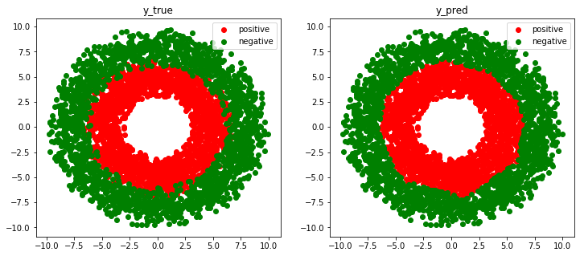

# binary-classification-using-tf2.2
binary classification using keras, medium-level APIs (i.e., subclassing tf.models.Model) and low-level APIs (subclassing tf.Module, costum loss and metric functions)

Demo:

